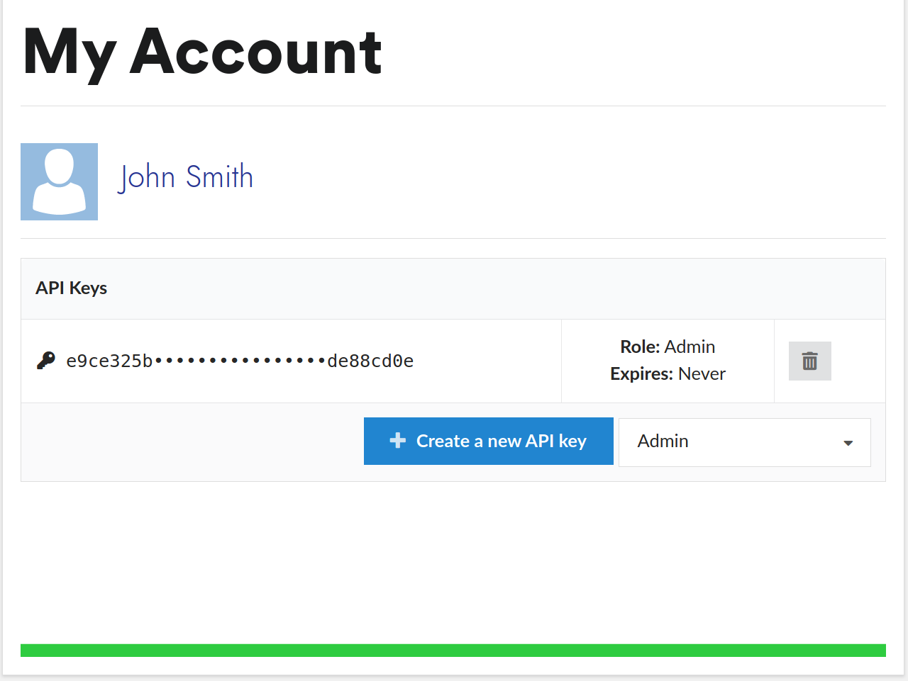

# kerfed-api-examples

Examples using the Kerfed API to analyze CAD assemblies.

## API Keys

These examples use an environment variable `KERFED_API_KEY`. To get an API key, log in to [kerfed.com/account](https://kerfed.com/account) and then use the API key management console to create an API key:
[](https://kerfed.com/account)


If you are on a Linux-like environment you can then add the key to your `~/.bashrc`:
```
export KERFED_API_KEY="46269139-4d96-405f-8092-dba7f832219a"
```

